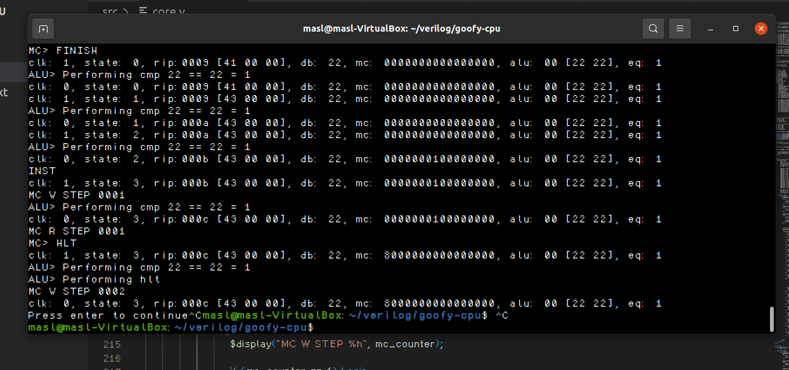
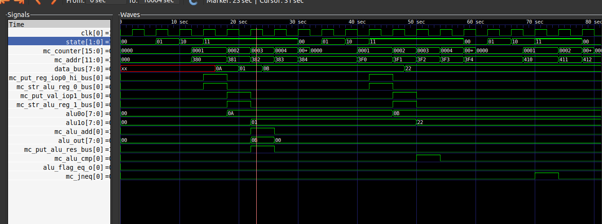

# Goofy CPU (Verilog)
A verilog implementation of my [goofy cpu](https://github.com/marceldobehere/goofy-cpu)!

It was mainly made to learn and try out verilog!

It has not been tested with a lot of stuff but for the test program it works which is cool.

Currently I am not working on this or the goofy cpu as I am working on other projects.

I might get back to this or to cpu dev in general though!

## Screenshots

